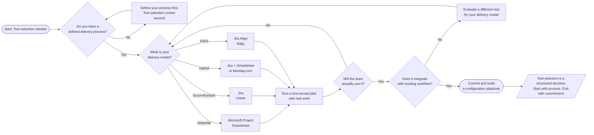

Every PM has been in this meeting. Leadership decides the organization needs to "get serious about project management." Someone says Jira. Someone else says Monday.com. A third person mentions they heard good things about Smartsheet. The decision gets made based on who spoke loudest, what the IT team already licenses, or what the last consultant recommended.
 
Three months later, the tool is half-configured, adoption is spotty, and the team is maintaining both the tool and a parallel spreadsheet.
 
This is not a tool problem. It is a strategy problem.

---
 
## 1. The Tool Is Not the Process
 
Here is the uncomfortable truth: most tool selection failures are process failures wearing a software costume.
 
Jira does not create a healthy backlog. Monday.com does not make your stakeholder communication clear. Smartsheet does not fix a risk management culture that treats the risk register as a compliance checkbox.
 
Tools amplify whatever process you already have. A disciplined team will make almost any tool work. A dysfunctional team will find ways to break the most elegant platform money can buy.
 
Before you evaluate a single tool, answer this: **Do you have a defined, repeatable process that the tool needs to support?** If not, start there.
 
---
 
## 2. Match the Tool to the Delivery Model
 
This is where most organizations go wrong. They pick a tool based on brand recognition or enterprise licensing, then try to retrofit their delivery model into it.
 
The right sequence is the opposite.

 
Jira is excellent for Scrum and Kanban. It is not the right tool for a traditional waterfall project with resource-leveled schedules and earned value reporting. Smartsheet is strong for plan-driven work but can feel clunky in a fast-moving Agile environment. Microsoft Project is powerful for complex scheduling but has a learning curve that will slow down team adoption.
 
None of these tools is universally right. All of them are situationally correct.
 
---
 
## 3. Adoption Is the Real Metric
 
A tool that 60% of the team uses consistently beats a perfect tool that 20% of the team trusts.
 
Tool selection decisions frequently optimize for features and underweight adoption. The PM discipline calls this a requirements gap: the stated requirement is "best features" when the actual requirement is "team will actually use this."
 
**Ease of entry matters more than depth of capability.** Most teams use 20% of any tool's features. Pick the tool whose 20% is the right 20% for your team, and whose interface does not require a certification to navigate.
 
**Integration reduces friction.** If the tool lives outside the team's existing workflow, it becomes optional. Tools that connect to Slack, Teams, email, and your CI/CD pipeline become part of how work actually happens instead of a separate system of record that people remember to update on Fridays.
 
**Enforce structure through the tool, not around it.** If your Definition of Done requires a link to a test case, build that as a required field. If your risk register needs a mitigation owner, make it mandatory. The tool should make the right thing easy and the wrong thing slightly harder.
 
---
 
## 4. The Portfolio Problem
 
Individual teams often choose tools in isolation. The result is a patchwork: Jira for the software team, Smartsheet for the PMO, Asana for marketing, a spreadsheet for finance. Everyone has visibility into their own work. No one has visibility across the portfolio.

 
This is where the PM role carries real leverage. The conversation is not "which tool should we use." It is "how do we create a single source of truth for portfolio-level status without forcing every team into the same workflow."
 
**Standardize on one platform with configurable workspaces.** One Jira instance, one Monday.com organization, one Smartsheet environment, configured differently per team type. This preserves portfolio visibility while allowing team-level flexibility.
 
**Use an integration layer.** Tools like Zapier, Make (formerly Integromat), or enterprise platforms like ServiceNow can pull data from disparate tools into a consolidated reporting view. More technical overhead, but viable when standardization is politically impossible.
 
**Accept the tradeoff.** Some organizations will never standardize. In that case, agree on what data must flow upward (status, RAG indicators, milestone dates, budget actuals) and build a lightweight reporting process around it. The tool becomes a source of data, not the source of truth.
 
---
 
## 5. What Good Tool Selection Actually Looks Like
 
Good tool selection is a structured decision, not a consensus vote.
 
Start with the delivery model and team maturity. Layer in integration requirements. Evaluate against adoption likelihood, not just features. Run a time-boxed pilot with real work, not a demo environment with sample data. Gather structured feedback at the end of the pilot. Make a decision and commit.
 
Then do the thing most organizations skip: **build a configuration playbook.** Document how the tool is set up, what fields mean, what workflows exist, and why decisions were made. This eliminates the "we lost our Jira admin and nobody knows how any of this works" problem that surfaces six months later when the original champion moves to a different team.

### Tool Selection Decision Flow

*Start with your delivery model. Validate adoption. Confirm integration. Then commit. Document how the tool is configured so the knowledge doesn't walk out the door.*
 
---
 
## The Talent Triangle Connection
 
| Talent Triangle Domain | Connection |
|---|---|
| **Ways of Working** | Matching tools to delivery models; knowing when to use Agile vs. plan-driven tooling |
| **Business Acumen** | Total cost of ownership, licensing decisions, ROI of tooling investments, portfolio visibility |
| **Power Skills** | Driving adoption, managing change across teams, stakeholder alignment on shared tooling strategy |
 
---
 
## Final Thought
 
Jira is not a strategy. Neither is Monday.com, Smartsheet, or any other platform your organization is considering.
 
The strategy is clarity on how work gets done, who owns what, and how progress is visible to the people who need to see it. The tool is how you operationalize that strategy at scale.
 
Get the strategy right first. The tool selection gets much easier from there.
 
---

*Note: It may seem that I'm picking on Jira here. I'm not. This tool just happens to be the tool that has the closest proximity to me in my day-to-day work life. You could switch Jira with any other ALM and these points would ring almost completely true with them as well.*
 
*PDU Note: Writing this post counts toward <a href="https://www.pmi.org/certifications/certification-resources/maintain/earn-pdus" target="_blank" rel="noopener noreferrer">PMI's Giving Back</a> under Create Content. Research, tool evaluation frameworks, and hybrid delivery considerations apply across all three Talent Triangle domains: Ways of Working, Business Acumen, and Power Skills. Log time spent writing and researching separately in CCRS.*