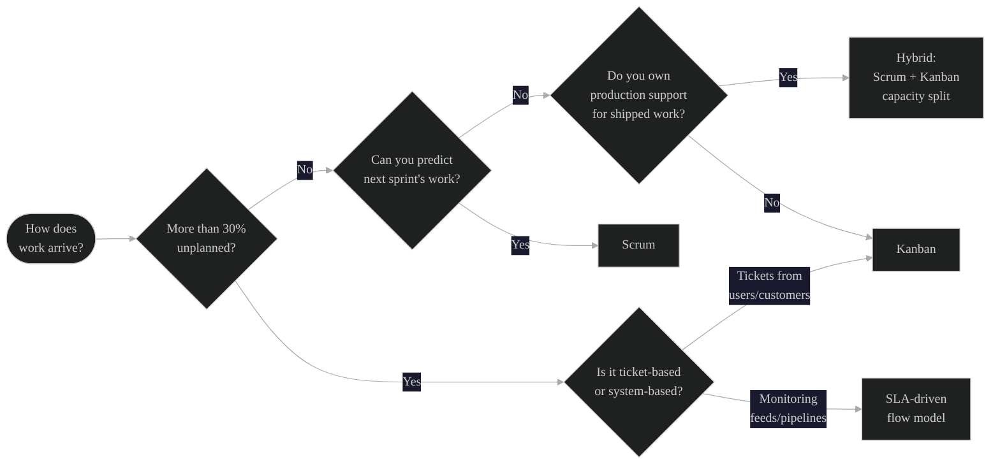

Your team runs two-week sprints. They have a backlog, a board, a velocity chart. On paper, this is an Agile team.
 
But half their work comes from service desk tickets that show up at random. A third of their capacity goes to monitoring data feeds that break without warning. And the sprint plan they committed to on Monday is already irrelevant by Wednesday because three P1 incidents landed before lunch.
 
This team does not have a discipline problem. They have a delivery model problem. They are running Scrum against work that does not behave like Scrum work.
 
It happens constantly. And it happens because organizations adopt a framework before understanding the nature of the work it needs to govern.
 
---
 
## 1. Work Has a Shape. Your Delivery Model Should Match It.
 
Not all work arrives the same way. That sounds obvious, but most organizations ignore it when choosing how to manage delivery.
 
Scrum was designed for a specific shape of work: complex, creative, uncertain product development where a cross-functional team can plan a batch of work, execute it in a timebox, and inspect the results. That shape assumes the work is largely plannable at sprint boundaries and that interruptions are the exception, not the norm.
 
When the work does not fit that shape, Scrum does not just underperform. It actively creates waste. Teams spend time planning sprints they know will be blown up. They carry over the same stories for three iterations in a row. They game their velocity to account for the chaos. And eventually they stop trusting the process altogether.

 
The fix is not "do Scrum better." The fix is to identify the shape of the work and select a delivery model that matches it.
 
---
 
## 2. Four Work Types Most Teams Actually Deal With
 
Here is a practical breakdown. Most organizations have some combination of all four, often on the same team.
 
**Planned product work.** This is Scrum's sweet spot. A known backlog of features, enhancements, or capabilities. The team can forecast what they will work on next sprint and commit to a goal. Work is largely predictable at the two-week horizon.
 
**Interrupt-driven service work.** Tickets arrive continuously from users, customers, or internal stakeholders. The volume is unpredictable. Individual items vary in size and urgency. The team cannot plan a sprint because they do not know what work will exist by Tuesday. Service desks, IT support, and operations teams live here.
 
**Continuous data and infrastructure flows.** Monitoring feeds, ETL pipelines, data quality checks, system health dashboards. The work is not project-shaped at all. It is ongoing, repetitive, and defined by the health of the flow itself. When things are working, the team is watching. When things break, the team is reacting. There is no sprint goal because the goal never changes: keep the data flowing.
 
**Mixed project and operations.** The team has a product roadmap, but they also own production support for what they have already shipped. Half their capacity is planned, half is reactive. This is the most common scenario in the real world and the one that breaks Scrum fastest.

 
---
 
## 3. What Actually Works for Each Work Type
 
### For planned product work

**Scrum works.** Use it. Sprint planning, daily standups, reviews, retros. The framework was built for this. No argument.
 
### For interrupt-driven service work

**Kanban.** Pull-based, no sprint boundaries, WIP limits to prevent overload. Work enters a queue, gets triaged by priority, and flows through the system. Cycle time and throughput replace velocity as the primary metrics. The team does not plan in batches because the work does not arrive in batches. They manage flow.
 
Service teams that try to force Scrum end up with half-empty sprints, meaningless velocity charts, and a planning ceremony that feels like a waste of time because it is.
 
### For continuous data and infrastructure flows

**SLA-driven monitoring with Kanban elements.** This work is defined by availability and response time, not by feature delivery. The board tracks system health states instead of user stories. Alerts and incidents replace backlog items. The "definition of done" is "the pipeline is running within acceptable parameters."
 
Teams running data feeds do not need sprints. They need dashboards, runbooks, and escalation paths. Trying to wrap this in Scrum ceremonies creates process overhead with zero value.
 
### For mixed project and operations

**A hybrid model with capacity allocation.** This is the hardest one, and the one that matters most. The team explicitly splits their capacity. For example, 60% toward planned sprint work and 40% reserved for operational interrupts. The sprint backlog only accounts for the planned portion. The operational portion runs on a Kanban board alongside the sprint board.

[Capacity split diagram](/img/capacity-split-diagram.svg)
 
This is not a compromise. It is an honest acknowledgment that the team serves two masters and the delivery model needs to reflect that reality. Without the split, the sprint commitment is a fiction and the team knows it.
 
---
 
## 4. How to Diagnose Which Model Your Team Needs
 
You do not need a consultant for this. Track three things for two weeks.
 
**How does work arrive?** Is it planned and batched, or does it show up continuously? If more than 30% of the team's effort comes from unplanned work, Scrum is already broken. You just have not admitted it yet.
 
**What is the team's planning horizon?** Can they predict what they will work on two weeks from now? If not, sprint planning is guesswork dressed up as a ceremony. Kanban or a flow-based model will serve them better.
 
**What does "done" mean?** If done means "feature shipped," Scrum fits. If done means "system is healthy" or "ticket resolved within SLA," you are measuring the wrong things with the wrong framework.

*Start with how work arrives. The answer points you to the right model.*
 
---
 
## 5. The PM's Role: Matching the Model to the Work
 
This is where project managers earn their keep. Anyone can run a sprint board. The harder skill is looking at how work actually flows through a team and making the call that the current model does not fit.
 
That means being willing to say: "We are running Scrum because that is what the organization adopted, but the nature of our work does not match the framework. Here is what I recommend instead, and here is the data to back it up."

 
It also means designing the governance around the delivery model you choose, not the other way around. Status reporting, risk management, stakeholder updates, and metrics all need to reflect how the team actually works. If the team runs Kanban, reporting on velocity is meaningless. Report on cycle time, throughput, and WIP age instead.
 
---
 
## PMI Talent Triangle
 
| Talent Triangle Domain | Connection |
|---|---|
| **Ways of Working** | Selecting and adapting delivery frameworks to match work type; understanding when Scrum, Kanban, flow-based, or hybrid models apply |
| **Business Acumen** | Aligning delivery models to operational realities and SLA commitments; capacity allocation as a strategic decision |
| **Power Skills** | Leading the conversation with stakeholders about why the current model is not working; building trust through honest assessment |
 
---
 
## Final Thought
 
Scrum is a great framework. It is not the only framework. And using it for work it was not designed to handle does not make your team more Agile. It makes them more frustrated.
 
The best PMs do not default to whatever delivery model the organization already uses. They look at the work, understand its shape, and choose the model that fits. Sometimes that is Scrum. Sometimes it is Kanban. Sometimes it is a hybrid that does not have a name yet because you designed it for your team's specific reality.
 
That is not breaking the rules. That is the entire point of Agile thinking.
 
---
 
**PDU Note:** *This post was created as part of my ongoing recertification under <a href="https://www.pmi.org/certifications/certification-resources/maintain/earn-pdus" target="_blank" rel="noopener noreferrer">PMI's Giving Back: Create Content</a> category. Writing and publishing original content in your area of professional practice is a qualifying PDU activity. This post addresses all three domains of the PMI Talent Triangle: Ways of Working (delivery model selection and adaptation), Business Acumen (capacity allocation and SLA alignment), and Power Skills (leading delivery model change conversations with stakeholders).*