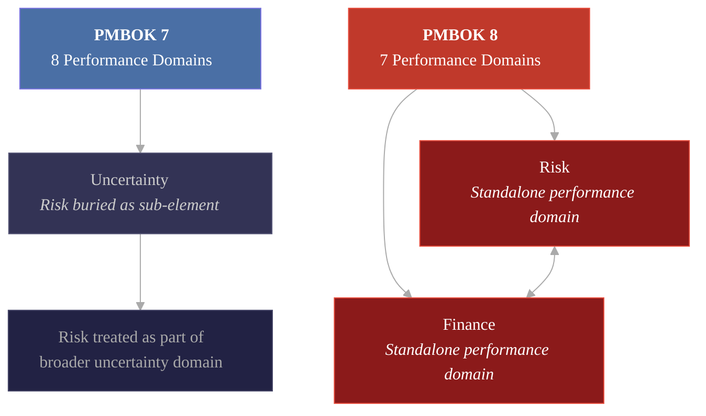

import DeferredPayoutChart from '../../../components/DeferredPayoutChart.astro';

The Los Angeles Dodgers owe their players $1.09 billion in deferred salary. Not in total contract value. In payments that have not been made yet, owed to players who in many cases will no longer be on the roster when the checks clear.

Shohei Ohtani alone accounts for $680 million of that number. His $700 million contract pays him $2 million per year while he plays. The other $680 million arrives in $68 million annual installments starting in 2034, when he is 40 years old and almost certainly retired. No interest. No adjustment for inflation. Just ten years of massive checks written against future revenue the organization has not yet earned.

This is not a baseball story. This is a risk management story. And every project manager should be paying attention.

---

## 1. The Anatomy of a $1.09 Billion Bet

The Dodgers did not stumble into this position. They engineered it. Across ten active contracts, the organization has systematically deferred compensation to create short-term payroll flexibility while stacking long-term obligations into the mid-2030s and 2040s.

The numbers tell the story. Ohtani's $680 million deferral is the headline, but Mookie Betts carries $115 million deferred, Blake Snell has $66 million, Freddie Freeman has $57 million, and Will Smith has $50 million. Six more players add another $121.5 million. Peak payout years hit around 2038 to 2039, when roughly $102 million per year comes due on top of whatever the active roster costs at that point.

And it is working. The Dodgers won back-to-back World Series titles in 2024 and 2025, becoming the first franchise to repeat since the 2000 Yankees and the first NL team to do it since the 1976 Reds. The 2025 run went seven games against Toronto, with Ohtani hitting .333, Yamamoto winning Series MVP, and Will Smith hitting the go-ahead home run in the 11th inning of Game 7. Ohtani, Yamamoto, Snell, Freeman, Betts, Smith. Every one of them is on a deferred contract. The Dodgers built a dynasty by borrowing against the future and spending it on the present. The championships are real. The bill has not arrived yet.

The strategy is legal. MLB's Collective Bargaining Agreement, Article XVI, explicitly permits unlimited deferred compensation with no restrictions on amount or percentage. For Competitive Balance Tax purposes, deferred payments are discounted to present value using a CBA-mandated rate (4.43% for Ohtani's contract), which drops his annual CBT charge from $70 million to approximately $46 million. The Dodgers get a generational talent at a market-rate luxury tax hit while paying him less cash per year than a mid-tier reliever.

The financial backbone of this strategy is an $8.35 billion, 25-year television deal with Spectrum that runs through 2039. The Dodgers became the first MLB team to generate $1 billion in gross revenue in the 2024 season. Their franchise valuation sits somewhere between $5.8 and $7.7 billion depending on the methodology.

Dodgers president Andrew Friedman has dismissed concerns directly. The team will plan for the obligations along the way. The math works if revenue keeps growing, inflation keeps eroding the real value of future payments, and the TV deal keeps paying.

That is a lot of "ifs" for a billion-dollar obligation.

<DeferredPayoutChart />

---

## 2. The $1-to-$4 Rule: How Deferred Costs Compound

Project managers already know this dynamic. They just call it something different.

In facilities management, the most widely cited benchmark is that every $1 of deferred maintenance becomes $4 to $7 in future costs when the work finally cannot be avoided. Cascading failures push the multiplier as high as 15x. Industry data shows deferred maintenance compounds at roughly 7% annually. Preventive maintenance delivers 545% ROI over 25 years according to a Jones Lang LaSalle study of 14 million square feet of commercial property.

At the federal level, the U.S. government's deferred maintenance backlog more than doubled from $171 billion to $370 billion between FY2017 and FY2024. The National Park Service carries $11.9 billion in deferred maintenance. The military faces $50 billion across 100,000 structures. ASCE's 2025 Infrastructure Report Card identified a $3.7 trillion investment gap nationwide, up from $2.59 trillion four years earlier.

In software, the pattern is identical. Stripe's 2018 Developer Coefficient study found developers spend 42% of their working time dealing with technical debt and maintenance, with only 13.5 hours per week going to new features. McKinsey surveyed 50 CIOs who estimated technical debt at 20 to 40% of the value of their entire technology estate.

The lesson is consistent across every domain. Deferred costs do not sit still. They compound. And the rate of compounding consistently surprises the people who made the original deferral decision.

---

## 3. Nine Real-World Failures Where Deferral Multiplied the Bill

The Dodgers' bet might work. These did not.

### **Flint, Michigan.** 
City officials saved $5 million by switching water sources without applying a $100-per-day corrosion inhibitor. The resulting lead contamination crisis cost over $1.5 billion in remediation, settlements, and emergency response. Twelve people died from Legionnaires' disease. That is a 300x cost multiplier from a single deferred maintenance decision.

### **Boeing 737 MAX.** 
Rather than designing a clean-sheet aircraft at an estimated $2 to $3 billion, Boeing spent 50 years patching a 1968 airframe. When larger engines did not fit the original landing gear, engineers mounted them forward and added software to compensate. Two crashes killed 346 people, triggered a 20-month grounding, and generated over $20 billion in direct losses and $60 billion in canceled orders. A Congressional report attributed the failures to decades of deferred engineering decisions.

### **Surfside Condo Collapse.** 
A 2018 engineering report warned of abundant cracking in structural concrete at Champlain Towers South in Florida. The board deferred action. A 2020 review found the condo association had only 6.9% of recommended reserve funding. In June 2021, the building partially collapsed, killing 98 people. Florida's subsequent condo safety law now requires reserve funding and structural inspections, with some buildings facing special assessments exceeding $400,000 per unit.

### **Illinois Pensions.** 
Politicians systematically underfunded required contributions for 50 years. Annual pension payments grew from $614 million in 1996 to $11.2 billion in 2025. The unfunded liability now stands at $142 to $144 billion. Pension costs consume 25% of general fund spending. At $1 million extra per day, it would take 597 years to close the gap. The SEC charged the state with securities fraud for misleading investors about the obligations.

### **NYC Transit.** 
The subway relies on signal technology from World War II that would take 50 years and $20 billion to replace at the current pace. Train delays from infrastructure failures rose 46% since 2021. The MTA needs $43 billion over 20 years for repairs and upgrades.

### **Washington Metro.** 
A 2009 crash killed 9 people and injured 80, attributed in part to decades of deferred maintenance. The system later required emergency "SafeTrack" shutdowns across 16 safety surges.

### **Healthcare.gov.** 
The project went from $93.7 million to $1.7 to $2.1 billion after testing and architectural decisions were deferred under schedule pressure. Six users completed applications on launch day.

### **Knight Capital.** 
Deprecated code that should have been removed years earlier was accidentally reactivated during a server update. The firm lost $440 million in 45 minutes.

### **Bobby Bonilla Day.** 
The Mets deferred a $5.9 million obligation at 8% interest, confident that Bernie Madoff's returns would cover it. Total payout: $29.8 million through 2035. A 5x multiplier, and the deal that directly inspired the Dodgers' current strategy.

---

## 4. PMBOK 8 Elevates Risk to Where It Belongs

PMBOK 8, released in November 2025, made a structural change that speaks directly to this problem. Risk management was elevated from a sub-component of "Uncertainty" in PMBOK 7 to a standalone Risk Performance Domain, equal in status to Scope, Schedule, and Finance.

This is not a cosmetic reorganization. It reflects a profession-wide recognition that risk management deserves dedicated governance, not a supporting role tucked under another domain. The new framework includes Risk Velocity Analysis (how quickly risks can impact objectives), leading indicators as early warning metrics, and explicit linkage between the Risk and Finance performance domains.

For deferred cost scenarios specifically, PMBOK 8 supports Monte Carlo simulation, scenario planning, and sensitivity analysis as core tools within the Risk domain. The practical application: model costs as time-phased cash flows, not static endpoints. Apply growth rate distributions that reflect compounding. Run enough iterations to generate confidence intervals at P50, P80, and P90 levels. For any deferred cost decision, the simulation formula within each iteration is straightforward: Base Cost multiplied by (1 + growth rate) raised to the power of years deferred, where the growth rate is randomly sampled from a probability distribution.

Beyond PMBOK, ISO 31000:2018 emphasizes that risks are dynamic and change over time. That makes periodic reassessment mandatory for compounding liabilities. COSO ERM's Principle 14 requires a portfolio view of risk. Both frameworks reinforce what the Dodgers' balance sheet makes viscerally clear: you cannot evaluate a single deferred obligation in isolation. You have to look at the aggregate.

---

## 5. The CBA Is About to Expire. So Are the Rules.

Here is where the Dodgers' strategy gets its most direct PM parallel: regulatory risk.

The current MLB CBA expires December 1, 2026. The rules that made the Dodgers' deferral strategy possible could change. MLBPA interim executive director Bruce Meyer told players in March 2026 to expect a lockout. MLB has reportedly set aside a $2 billion war chest. The last CBA expiration produced a 99-day lockout.

Deferred compensation reform is already on the table. During the 2021 negotiations, MLB proposed limiting deferrals. The MLBPA rejected restrictions because deferrals enable larger headline contract values for stars. But the political dynamics have shifted. The Dodgers now account for roughly two-thirds of all deferred compensation across the entire league. A Seton Hall University legal analysis recommended capping the percentage of any contract that can be deferred. And in a notable precedent, the NHL agreed in July 2025 to eliminate deferred salaries entirely in its new CBA.

Existing contracts would almost certainly be grandfathered under any new rules. Labor law precedent and past CBA transitions consistently apply financial rule changes prospectively. But a new CBA could change how existing deferred contracts are valued for CBT purposes, altering the discount rate or calculation methodology to increase the Dodgers' luxury tax exposure without changing the underlying payment obligations.

The PM parallel is precise. The Dodgers built a $1.09 billion financial structure under rules that the other party to the governing agreement has explicitly tried to change before. That is regulatory obsolescence risk. PMBOK 8's Risk Performance Domain addresses it through continuous environmental scanning. Most project risk registers do not.

---

## 6. What PMs Should Take From This

You do not need to manage a baseball team to face deferred cost risk. Every project portfolio carries some version of it.

### **Technical debt**
Technical debt is the most common form. The shortcut you took in sprint 4 does not show up as a cost in sprint 4. It shows up as a velocity drag in sprint 14, a production incident in sprint 24, and a full rewrite estimate in sprint 34.

### **Deferred maintenance** 
Deferred maintenance is the facilities version. Skip the HVAC inspection this quarter, defer the roof replacement this fiscal year, push the server refresh to next budget cycle. Each individual decision looks rational. The aggregate creates a compounding liability that eventually forces an emergency response at 4 to 7 times the original cost.

### **Deferred stakeholder alignment** 
Deferred stakeholder alignment is the power skills version. Skip the difficult conversation about scope with the sponsor now. Defer the vendor renegotiation. Postpone the organizational change management plan. These feel like schedule gains. They are borrowed time with interest.

A practical risk register for deferred costs should extend beyond standard fields to include the time horizon (when the liability crystallizes), the growth rate (how it compounds), the current versus projected exposure at 1, 3, and 5-year horizons, and the trigger conditions that force payment. Track Total Deferred Cost Exposure at the portfolio level with a growth rate metric showing period-over-period acceleration.

---

## The PM Talent Triangle Connection

| Talent Triangle Domain | Deferred Risk Connection |
|---|---|
| **Ways of Working** | Risk register design for long-horizon liabilities, Monte Carlo modeling for deferred cost scenarios, PMBOK 8 Risk Performance Domain application |
| **Business Acumen** | Present value vs. nominal value, compounding cost dynamics, portfolio-level financial exposure tracking |
| **Power Skills** | Communicating deferred risk to sponsors who prefer optimistic timelines, making the case for preventive investment over reactive response |

---

## Final Thought

The Dodgers might pull this off. Two straight championships say the strategy is delivering. They have $1 billion in annual revenue, a $7 billion franchise, a TV deal that runs through 2039, and two trophies that did not exist before the deferrals made the roster possible. They can absorb more risk than almost any organization in professional sports.

But the lesson for PMs is not about whether the Dodgers win the bet. It is about the bet itself. Every deferred cost, every skipped maintenance cycle, every technical debt item left on the backlog, every difficult conversation postponed to next quarter creates a compounding obligation that grows whether you are watching it or not.

Don Reinertsen's foundational research with McKinsey showed that six months of delay reduces a product's lifecycle profits by 33%, making lateness roughly 10 times more costly than being over budget. And yet 85% of product development organizations do not quantify the cost of delay.

PMBOK 7 called it Stewardship. PMBOK 8 gave Risk its own performance domain. The Dodgers call it financial strategy. Flint, Boeing, Illinois, and Surfside call it catastrophe.

The bill always comes due. The only question is whether you planned for it or got surprised by it.

---

*This post was created as part of my ongoing recertification under <a href="https://www.pmi.org/certifications/certification-resources/maintain/earn-pdus" target="_blank" rel="noopener noreferrer">PMI's Giving Back to the Profession: Create Content</a> category.* 

*Writing and publishing original content in your area of professional practice is a qualifying PDU activity. This post addresses all three domains of the PMI Talent Triangle: Ways of Working (risk register design for long-horizon liabilities, Monte Carlo simulation for deferred cost modeling, PMBOK 8 Risk Performance Domain applied to compounding obligations), Business Acumen (present value vs. nominal value analysis, deferred cost compounding dynamics, portfolio-level financial exposure tracking across multi-year horizons), and Power Skills (communicating deferred risk to stakeholders, building the case for preventive investment, navigating the tension between short-term budget pressure and long-term liability management).*