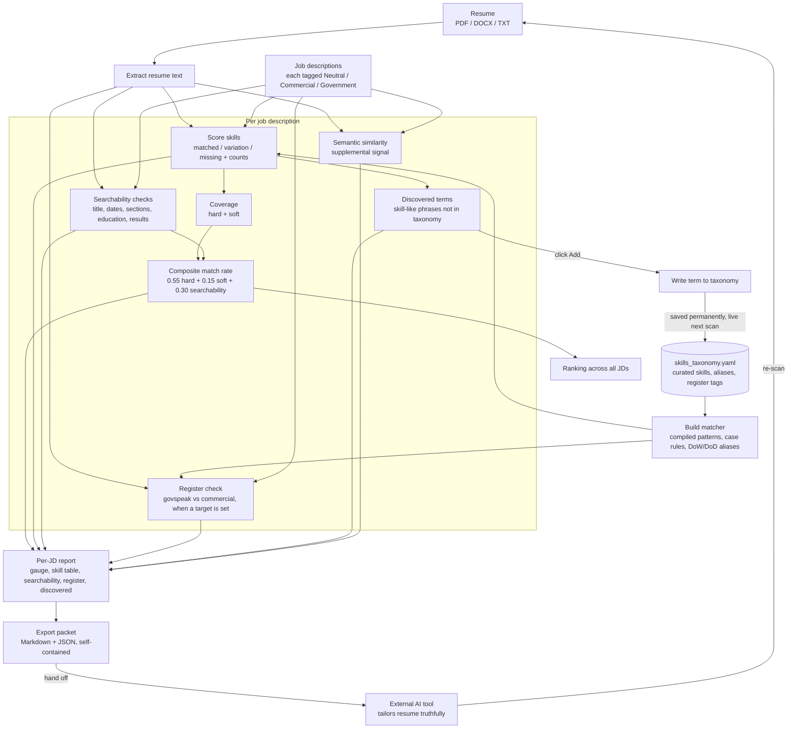

On June 23rd of this year, our team's last day on the ASCT support contract at ManTech came and went. The contract was ended, and with it the work that a group of good people had been counting on. I am not going to dress that up. It is a stressful thing to live through, for me and for the folks who were on it with me. There are bills, there is a family at home, and there is the very ordinary human weight of going from a known thing to an open question overnight.

## The Need

When a contract ends, the clock starts immediately. The job search is its own job, and the first wall you hit is not a hiring manager. It is software. Most companies, and nearly every prime and mid-tier shop I am targeting in San Antonio, run an Applicant Tracking System that reads, scores, and sorts resumes before a single person looks at them. A strong background does not matter if the ATS files you below the fold. I have watched qualified people get screened out not because they could not do the work, but because their resume did not speak the posting's language closely enough for the machine to flag them as a match.

I have friends in recruiting, and several of them have ATS-style tooling built into their platforms. They are generous people, but they are also busy, and a job search does not wait for a favor to come back around. Asking someone to run my resume through their system, then waiting on a reply, then iterating, then waiting again, is too slow when I am trying to push out tailored applications every day. I needed to own that loop myself. I needed to be able to sit down, paste in a job description, and know in minutes whether my resume was going to clear the gate or die in the queue.

So I built it. [You an read more on the technical side of the project here.](/projects/ats/) 

## The Requirement

The requirement was simple to state and harder to satisfy. I needed a tool that compares my resume against a posted job description and tells me, honestly, how well they match. The bar I set was a resume that comes back at a minimum of 85 to 90 percent matched to the company's JD. That is the range where you stop being invisible to the ATS and start being a highly visible candidate, the kind that actually surfaces in a recruiter's search and lands in the human review pile.

Matching the machine is only half the strategy. The other half is people. I am working my network hard, scouring for referrals, because a warm introduction plus a resume that clears the ATS is a far stronger position than either one alone. The tool's job is to handle the first half reliably so I can spend my energy on the second. Get the resume past the filter, get a human to vouch for me, and the odds change.

I also needed it to handle the reality of my search, which is that I am not chasing one kind of role. I am going after Product Owner, Product Manager, Agile SME, Release Train Engineer, Project Manager, Program Manager, and IT Manager positions, and I am doing it across both government contracting and commercial work. The tool had to speak both dialects without getting confused.

## The Product Delivery

What follows is the part I am proud of, because the path to a good tool was not a straight line. It was an iteration, and the dead ends taught me as much as the wins. My manufacturing engineering background kept showing up here. This was a process problem before it was a software problem, and you do not fix a process by polishing the first thing that runs.

### Starting point

I began with a Streamlit app that compared a resume to multiple job descriptions using sentence embeddings and some natural language processing. It was clean, fully local, which mattered because everything about this needed to stay on my own hardware.

I went with Streamlit on purpose, and not just because it is quick to stand up. I have been using it for a while to dashboard potential Fantasy Baseball player candidates, ranking targets, weighing matchups, and quietly building an edge over the rest of my league. So to my Fantasy Baseball teammates reading this: yes, the player management secret is officially out of the bag. The same tooling I use to scout waiver-wire pickups is the tooling I pointed at my own career. Make of that what you will, and good luck catching up.

### The noise problem

The early versions kept surfacing the wrong keywords. Instead of the skills a recruiter actually cares about, the tool pulled vague phrases like "technical guidance" and "new technology," along with company names and boilerplate. I tried to make the extraction smarter by scoring candidate phrases against the concept of a skill, dynamically, with no hardcoded list of words to exclude. That helped with the obvious junk, but it exposed a deeper issue. The tool could tell a skill-ish phrase from filler, but it could not tell a concrete, screenable skill like Jira or SAFe from an abstract topic. Worse, near synonyms were landing on opposite sides of the match line. "System architecture" would count as matched while "reference architecture" three words later got flagged as missing. The missing list was inflated with false gaps.

### The turn that fixed it

The breakthrough came from studying how the commercial tools actually work. They do not extract keywords from the job description and hope. They match against a curated dictionary of known skills. The cleanliness I was chasing was a direct result of an inclusion list, the inverse of what I had been trying to build. That was the unlock.

So I built a skills taxonomy tuned to exactly my lane. A few hundred terms covering Agile and SAFe, project and program management, DevSecOps and IT delivery, the federal and defense vocabulary, and the leadership and soft skills these roles screen on. It lives in a plain, editable file next to the app. Matching became occurrence counting against known skills, and every required skill in a JD now comes back as one of three things: matched, a variation where I used different wording than the posting, or missing. Same two-column truth the good commercial tools give you.

### What it does now

The delivered tool gives me, per job description:

- A composite match rate, broken out into hard skills, soft skills, and searchability, so the number is explainable rather than a black box.
- A skill table showing matched, variation, and missing, with how many times each term appears in my resume versus the JD. This is the part that tells me, at a glance, where I am stacked on things they barely asked for and absent on things they need.
- Deterministic searchability and format checks, the exact job title, contact info, section headings, education level, date formatting, and measurable results, which are the literal reasons an ATS rejects a resume before a human ever sees it.
- A discovered-terms panel that surfaces skill-like phrases a JD uses that my vocabulary does not track yet, with a one-click Add that saves permanently. The tool's knowledge grows from my real job search instead of me maintaining it by hand.

### Two features built for how I actually work

First, an export packet. I gave real thought to wiring AI-generated resume suggestions directly into the tool using my local models. I already run Ollama on my desktop, and the hardware can serve a 14 to 20 billion parameter model comfortably. But I opted away from local AI for the suggestive fixes, on purpose. The local models I can run on my system are simply not as deep as I need them to be for this. Rewriting a bullet to truthfully fold in a missing skill, while flagging the ones I genuinely lack, is a job where the quality gap between a local model and a frontier commercial model is large enough to matter, especially when the output is going on a resume headed into a federal hiring pipeline. So rather than bolt on a weaker generator, I built the handoff to route that work to the strongest model I have access to.

The real bottleneck for good AI suggestions is not the model anyway, it is the context you hand it. So the tool assembles a self-contained packet per job, my resume, the full posting, and the computed gaps, in both a readable Markdown format and an upload-and-go JSON. I hand one file to a frontier AI with a built-in instruction to rewrite my experience truthfully toward the gaps, and it works from there. The local tool measures, the strong model writes, and I stay the human in the loop. The instruction explicitly forbids inventing experience, because in a federal hiring context, fabrication is disqualifying.

Second, register conflict detection. Because I am applying to both government and commercial roles, I built the tool to flag when the two dialects bleed into each other. A commercial recruiter reads "CDRL," "ATO," and "DoDAF" as someone who cannot translate out of govspeak. So when I aim a resume at a commercial role, the tool flags the government terms sitting in it and tells me, and the AI handoff, to translate or cut them. When I aim at a federal role, it nudges me if the resume reads too soft and corporate. Each posting carries its own target, so I can run commercial and government applications in the same batch and have each one judged correctly.

One detail worth mentioning, since it affects the vocabulary directly. The Department of Defense has transitioned into being renamed the Department of War. The executive order is in place and the term is in active use. Real job descriptions right now use both names. The tool treats "Department of War," "Department of Defense," "DoW," and "DoD" as one and the same, so a posting scores the same either way and my resume matches whichever form I wrote. It absorbs the naming churn without me having to think about it.

### How it works, end to end

Here is the whole flow in one picture. The resume and the job descriptions come in on the left, the curated taxonomy drives the matching engine in the middle, and the per-JD analysis fans out into the ranking, the report, and the export packet. The two loops are the part I am happiest with: clicking Add on a discovered term writes it back into the taxonomy so it counts on the next scan, and the export packet feeds an external AI that hands back a tailored resume I run right back through the tool.

### Where it stands

It runs locally on my desktop, it is fast, and it does the one thing I needed it to do: tell me, before I hit submit, whether this resume is going to clear the gate for this specific posting. I may eventually host it so I can reach it from anywhere, likely by containerizing it and putting it behind Cloudflare Zero Trust with email-based authentication, so it stays locked to me while becoming reachable off my desk. That is a future maybe, not a commitment, and something I will only do if I decide it is worth it. It is a convenience, not a requirement. The requirement is met today.

## Points of Caution

I built this to help me, not to fool myself, so it is worth being honest about what it is and is not. This tool is **far** from being perfect. A few things I keep in mind every time I use it:

- **The score is a proxy, not the real ATS.** Every company runs a different system, and Workday, Taleo, iCIMS, and Greenhouse all parse and weight resumes their own way. My composite match rate is a directional gauge built to approximate that behavior, not a readout of what any specific employer's software will actually score me. An 85 to 90 percent here means I am in good shape, not that I am guaranteed to clear their gate.

- **The taxonomy is the tool's knowledge, and it has blind spots.** Anything phrased a way the vocabulary does not track reads as a gap, even when the skill is sitting right there in my resume. I saw this the first time I ran it, when "Agile Release Trains" came back missing only because I had listed the plural and the taxonomy held the singular. That is the tradeoff I chose over open-vocabulary noise, and it means the tool is only as sharp as what I feed it. It gets better over the first several scans, not on day one.

- **It is tuned to my lane, on purpose.** This is built for Product Owner, Product Manager, Agile, RTE, and program and IT management roles across government and commercial work. Inside that lane it is strong. Point it at a nursing job or a sales role and it will be far less useful, because I never built the vocabulary for those. It is a scalpel for my search, not a general-purpose matcher.

- **Do not chase the number into keyword stuffing.** It would be easy to cram terms in until the percentage looks great, and that is a trap. The resume still has to read well to a human and, more importantly, it has to be true. A keyword-stuffed resume that clears the machine and then reads like nonsense to a recruiter has failed at the only thing that matters. The score is a tool, not the goal.

- **The AI handoff still needs my eyes.** The export packet tells the model to rewrite truthfully and never invent experience, but a model can still produce a bullet that sounds right and is subtly wrong. I review every suggestion before it goes anywhere near my actual resume. In a federal hiring context, an inflated or fabricated claim is not a small mistake, it is disqualifying.

- **The checks are heuristics, so they can be wrong.** The searchability flags and the register conflict detection are pattern-based, and a few terms genuinely live in both the government and commercial worlds. The tool will occasionally flag something it should not, or miss something it should catch. It is there to prompt my judgment, not replace it.

- **Garbage in, garbage out on parsing.** If I feed it a scanned PDF or a resume built from heavy tables and columns, the text extraction suffers, the same way those formats choke a real ATS. That is actually a useful signal, if my own tool struggles to read the resume, the employer's system probably will too, but it does mean I have to give it clean input to get a clean read.

- **It complements referrals, it does not replace them.** This was always half of the strategy. Clearing my own bar gets me visible to the machine. It does not get me hired. The warm introductions I am working for through my network are still doing the heaviest lifting, and the tool exists to free up my time for exactly that.

- **If I ever expose it, the security boundary is the gateway, not the app.** Should I host this behind Cloudflare Zero Trust down the road, it is worth remembering that the app itself has no login of its own. The authentication layer is the only thing standing between the open tool and the internet, so that has to be configured correctly and treated as the real lock.

## Closing

I would be lying if I said I would have chosen to spend my first days off-contract building software. But the job search is a grind, the ATS is a real gatekeeper, and waiting on someone else's tooling was costing me time I did not have. Building this gave me back control over the part of the process that was otherwise a black box. It also did the thing that work always does in a hard stretch. It gave me a problem I could actually solve while the bigger ones stayed open.

The contract ended. The work continues. And now I have a tool that makes sure the resumes I send are the best version of me that the machine will let through.

- Jeff