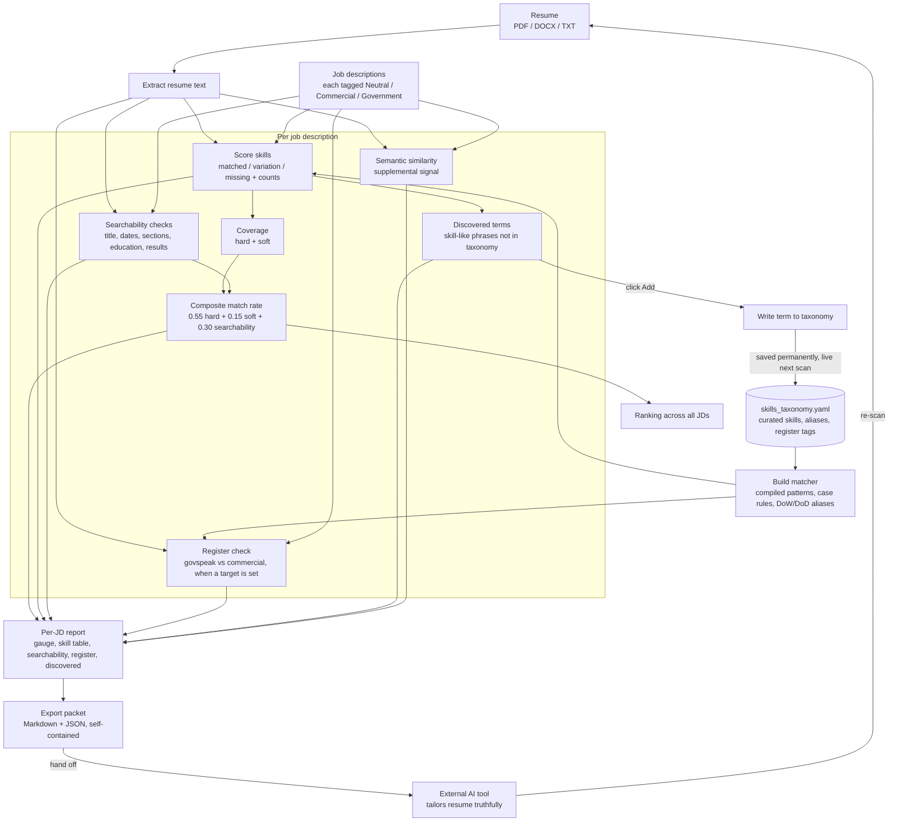

A local-first tool that scores a resume against any number of job descriptions, tells me exactly where the gaps are, and packages everything I need to tailor each application. I built it to get my resume past Applicant Tracking Systems and stay highly visible to recruiters during an active job search across both government contracting and commercial roles.

## Overview

Most companies run resumes through an ATS before a human ever sees them. A strong background does not matter if the software files you below the fold. I needed to own that feedback loop myself: paste in a job description, get an honest match score in minutes, see which skills are matched, mismatched, or missing, and produce a tailored resume that clears the gate.


*ATS Resume Matcher*

This tool does that. It runs entirely on my own hardware, uses a curated skills vocabulary tuned to my target roles, and is built to handle the reality that I apply to both federal and commercial positions, which speak different dialects.

## Tech Stack

- **Python 3** with **Streamlit** for the interface and dashboarding
- **spaCy** (`en_core_web_trf`) for tokenization, noun-chunking, and entity filtering
- **sentence-transformers** (`all-MiniLM-L6-v2`) for semantic similarity and concept-anchored relevance scoring
- **pdfplumber** and **docx2txt** for resume text extraction
- **plotly** for the match-rate gauge and category breakdowns
- **PyYAML** for the editable skills taxonomy
- Designed to run locally, with optional future containerization

## Architecture



## How the Matching Works

Early on, I extracted keywords directly from each job description and scored against them. The results were noisy: vague phrases, company names, boilerplate, and near synonyms landing on opposite sides of the match line. The fix was to stop guessing at keywords and match against a curated dictionary of known skills instead.

The heart of the tool is a **skills taxonomy** stored as an editable YAML file. Each entry holds a canonical skill name, a list of surface forms and aliases, a hard-or-soft type, an optional register tag, and case-sensitivity rules. Matching is word-boundary occurrence counting against those forms, which gives clean, explainable results instead of fuzzy approximations.

```
  - name: "Release Train Engineer"
    type: hard
    forms: ["Release Train Engineer", "RTE"]
```

For every required skill in a job description, the tool reports one of three states:

- **Matched**: the resume and the JD share the same form
- **Variation**: both have the skill, but worded differently (resume says "Agilist," JD says "Agile")
- **Missing**: the JD requires it and the resume has nothing

Short all-caps acronyms like FAR, SOW, RMF, and ATO are matched case-sensitively so they never trigger on lowercase English words, and a few deliberately case-locked terms like SAFe avoid false hits on common words.

## Features

### Composite Match Rate

A single, explainable score per job description, broken into hard skills, soft skills, and searchability, shown as a gauge with a category breakdown. The weighting is transparent: 55 percent hard skills, 15 percent soft, 30 percent searchability. A semantic similarity score runs alongside as a supplemental context signal rather than the headline number.

### Searchability and Format Checks

Deterministic checks for the literal reasons an ATS rejects a resume: exact job title match, contact information, section headings, education level against the posting, date formatting, and quantified results. No fuzzy matching, just the format hygiene that gets resumes auto-filtered.

### Multi-JD Comparison

Load several postings at once and rank them by composite match, with a per-JD detailed breakdown in its own tab. This shows me, at a glance, which openings I am naturally strongest for.

### Discovered Terms with Persistent Click-to-Add

After each scan, the tool surfaces skill-like phrases a job description uses that my taxonomy does not yet track. One click promotes a term into the vocabulary, written straight back to the YAML file on disk. Because the loader is cached on the file's modification time, the change goes live on the next scan with no restart and no manual refresh, and it survives reboots. The vocabulary grows from my real job search instead of being maintained by hand.

### Register-Conflict Detection

Because I apply to both government and commercial roles, each posting carries a target register: Neutral, Commercial, or Government. When I aim a resume at a commercial role, the tool flags government and defense jargon sitting in it, the kind a commercial recruiter reads as untranslated govspeak, and tells me to translate or cut it. When I aim at a federal role, it nudges me if the resume reads too soft and corporate. Each posting is judged on its own register, so I can run commercial and federal applications in the same batch and have each one evaluated correctly.

### Naming-Churn Handling

The Department of Defense is being renamed the Department of War. The term is in active use while the legal change works through Congress, so real postings use both names. The tool treats "Department of War," "Department of Defense," "DoW," and "DoD" as one skill, so a posting scores the same either way and my resume matches whichever form I wrote.

### AI Handoff Packets

The strongest generative AI I have access to is commercial, and the real bottleneck for good suggestions is the context you hand the model. So instead of building weaker local generation in, the tool assembles a self-contained packet per job, my resume, the full posting, and the computed gaps, in both a readable Markdown format and an upload-and-go JSON. I hand one file to a frontier model with a built-in instruction to rewrite my experience truthfully toward the gaps and never invent anything, then I review every suggestion before it touches my actual resume. The tool measures, the strong model drafts, and I stay the human in the loop.

## Design Decisions

**Curated taxonomy over open-vocabulary extraction.** Trying to extract keywords from arbitrary text produced too much noise and too many false gaps from near synonyms. A focused, hand-tunable vocabulary tuned to my role cluster gives clean, trustworthy results. The tradeoff is that anything phrased a way the taxonomy does not track reads as a gap, which the discovered-terms loop closes over time.

**Local-first.** Everything runs on my own machine. No external services, no accounts, no per-scan cost, which matters for a tool I run dozens of times a day.

**Measurement local, generation external.** Local language models I can run are not as deep as I need for resume rewriting, so I deliberately kept the generation work routed to a frontier model and used the tool to produce a perfect, self-contained context packet for it.

**Data, not code, holds the knowledge.** The skills taxonomy and the register tags live in a plain YAML file. I can hand-edit it, version it in git, or grow it by clicking in the app, all without touching the matching logic.

## Limitations

- The match rate is a proxy for how an ATS behaves, not a readout of any specific employer's system.
- The taxonomy is tuned to my target roles. Outside that lane it is far less useful by design.
- It is decision support, not a guarantee. Clearing the bar gets me visible, not hired, and referrals still do the heaviest lifting.
- The AI handoff always requires my review, since a model can produce a plausible but inaccurate bullet.

## Status

The tool is built, tested, and in active use across my job search. It runs locally and does the one thing I needed: tell me, before I submit, whether a resume is going to clear the gate for a specific posting. Possible future work includes containerizing it and exposing it securely so I can reach it from anywhere, but that is a convenience rather than a requirement.