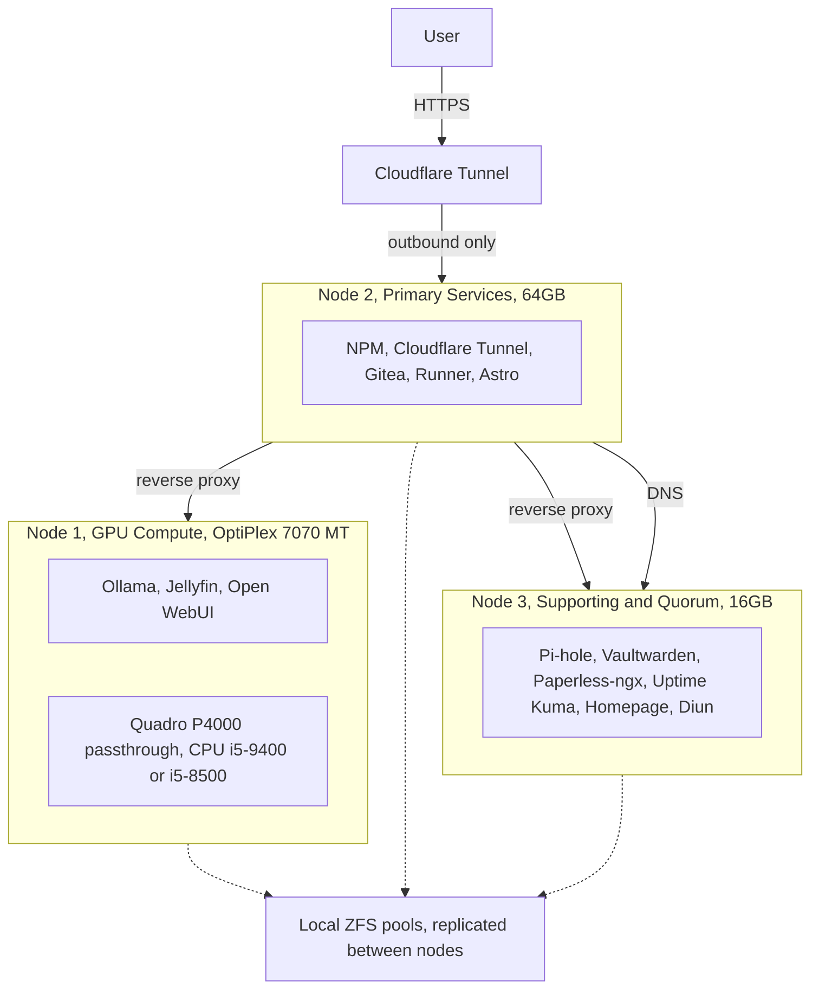

First off, I'm not a network guy. I'm seriously just building this out to host my site... and host my music... and host my movies... and host my files...

I may have created a lot of work for myself... Time for Day 0!

# What Is Day 0?

Day 0 is the planning phase before any hardware is racked or any software is installed. It locks in requirements, architecture decisions, hardware selection, and the rationale behind every major choice. A clean Day 0 means Day 1 deployment goes smoothly, because the hard questions are already answered on paper. This document concentrates on the design and the equipment, with the Node 1 CPU choice treated as the open decision still in progress.

---

# Design Principles

These principles drive every equipment and placement decision below:

1. No open ports on the home router. All external access flows through an outbound only Cloudflare Tunnel.
2. Network critical services stay on a low churn node, not on Node 1 during GPU setup.
3. Storage uses ZFS replication with a bounded, understood data loss window, not shared storage.
4. The GPU is passed through to a VM for both AI inference and media transcoding.
5. Services are isolated in LXCs, with Docker inside where needed.
6. Website deployments are immutable, built from CI/CD and shipped as SHA tagged images.

---

# Equipment

Three nodes form a Proxmox VE 9.2 cluster. Each carries a role chosen to match its hardware, not the other way around.

## Node 1, GPU Compute Node

**Dell OptiPlex 7070 MT**

This is the node with the open CPU decision, covered in detail in the next section.

| Component | Selection |
| :--- | :--- |
| Chassis | Dell OptiPlex 7070 Mini Tower |
| Chipset / Socket | Intel Q370, LGA1151 |
| CPU (current) | Intel i9-9900 (8C/16T, up to 4.9 GHz, 65 W) |
| CPU (target) | Intel i5-9400 or i5-8500 (6C/6T, up to 4.1 GHz, 65 W) |
| RAM | 32GB DDR4-2666 (4x8GB) |
| GPU | NVIDIA Quadro P4000 (8GB VRAM) |
| Storage | NVMe SSD |
| Network | 2.5GbE PCIe NIC |
| PSU | 500W ATX via Dell proprietary to ATX adapter |

Rationale for the platform pieces:

The Quadro P4000 was chosen because it is a workstation card that does not hit the consumer GeForce passthrough problems. No Code 43, no vendor reset hacks. Its 8GB of VRAM comfortably fits a 7B to 8B parameter model at Q4_K_M quantization with headroom left for conversation context.

The integrated UHD 630 graphics serve two jobs. They provide a Quick Sync hardware encode path for Jellyfin as a fallback, and they keep a permanent console display on the Proxmox host after the Quadro is passed through to the VM. That avoids the no video if something breaks failure mode. This point matters directly for the CPU choice, covered below.

The 500W ATX PSU, fitted through the existing adapter, solves the proprietary Dell power limitation. The stock 260W unit could not feed the Quadro P4000 under combined CPU and GPU load.

This node runs a single VM for the AI and media stack, so the workload is bound by the GPU. The CPU mostly feeds data to the card and carries OS overhead.

## Node 2, Primary Services Node

**HP EliteDesk 800 G4 Mini, 64GB**

| Component | Selection |
| :--- | :--- |
| CPU | Intel i7-8700 (6C/12T, up to 4.6 GHz) |
| RAM | 64GB DDR4 |
| Storage | NVMe SSD |
| Network | 1GbE onboard |

This node carries the most critical and most memory hungry services: Nginx Proxy Manager, Cloudflare Tunnel, Gitea, the Gitea Actions runner, and the Astro site. The 64GB of RAM keeps CI/CD builds clear of memory pressure and leaves room for generous Docker build caching. The 12 threads handle concurrent Git operations, build steps, and proxied connections without contention. 1GbE is enough, since inter node traffic is limited to small ZFS snapshot deltas and Corosync heartbeats.

## Node 3, Supporting Services and Quorum 

**HP EliteDesk 800 G4 Mini, 16GB**

| Component | Selection |
| :--- | :--- |
| CPU | Intel i7-8700 (6C/12T) |
| RAM | 16GB DDR4 |
| Storage | NVMe SSD |
| Network | 1GbE onboard |

This node supplies the third vote for cluster quorum, without which the cluster cannot reach consensus and HA will not function. It hosts the lighter services: Pi-hole, Uptime Kuma, Homepage, Diun, Vaultwarden, and Paperless-ngx. DNS lives here on purpose, not on Node 1. This is a build out phase decision, not a claim that a GPU node is inherently unstable. While you are still configuring passthrough, swapping drivers, and trying AI models, Node 1 gets rebooted often, and losing DNS on every one of those reboots would disrupt the whole network. Once the GPU configuration is stable, that concern largely goes away. Putting DNS on a low churn node is still good practice regardless, so it stays here.

## Shared Infrastructure

A single switch with one 2.5GbE port and several 1GbE ports connects all three nodes. Node 1 runs at its full 2.5GbE; Nodes 2 and 3 use 1GbE. For light inter node traffic this is sufficient. A pre existing adapter on Node 1 converts the OptiPlex proprietary 6 pin motherboard power connector to standard ATX, which is what enables the 500W PSU swap. This is a known working solution from a prior build.

---

# The CPU Decision (Node 1)

This is the only open equipment question. The node currently runs an i9-9900. The goal is a more power efficient chip, with the i5-9400 and i5-8500 as the two candidates, constrained by the OptiPlex 7070 motherboard.

## Compatibility, confirmed

The 7070 MT uses the Q370 chipset on an LGA1151 socket and officially supports both 8th Gen (Coffee Lake) and 9th Gen (Coffee Lake Refresh) Core processors. Dell's own supported processor table for the 7070 Tower lists all three relevant chips:

| CPU | Gen | Cores / Threads | Boost | TDP | iGPU | On Dell list |
| :--- | :--- | :--- | :--- | :--- | :--- | :--- |
| i9-9900 (current) | 9th | 8C / 16T | 4.9 GHz | 65 W | UHD 630 | Yes |
| i5-9400 (target) | 9th | 6C / 6T | 4.1 GHz | 65 W | UHD 630 | Yes |
| i5-8500 (target) | 8th | 6C / 6T | 4.1 GHz | 65 W | UHD 630 | Yes |

Because both i5 options sit on Dell's official list, the BIOS already carries the microcode for either one. There is no BIOS gamble in either direction. Drop it in and it boots.

## Where the efficiency actually comes from

A point worth being precise about: all three chips, including the i9-9900, share the same 65 W TDP rating. So the efficiency gain does not come from the TDP number on the box. It comes from two things:

1. Fewer cores and no Hyper-Threading. The i5 chips are 6C/6T versus the i9's 8C/16T. Under sustained all core load the i9-9900 pulls well above its 65 W base rating during turbo, while a 6C/6T part stays much closer to it. Peak and sustained package power drop with the i5.
2. The workload on this node is bound by the GPU. Ollama runs on the Quadro, and Jellyfin transcodes through the Quick Sync block or NVENC, so neither leans on raw CPU cores. The CPU sits at low utilization most of the time, which means the i9's extra eight threads are never exercised here. Dropping to a 6C/6T part lowers the worst case power ceiling and trims a little light load draw, with no effect on a job the CPU was barely doing in the first place.

In short, the i5 trades away cores this node never uses for a lower power ceiling, with no practical hit to its actual job.

## i5-9400 versus i5-8500

These two are close to interchangeable for this build:

- Both are 6C/6T, 9MB cache, up to 4.1 GHz boost, 65 W, with the same UHD 630 iGPU and the same Quick Sync encode block. The Jellyfin fallback path behaves identically on either.
- The i5-8500 actually carries a slightly higher base clock (3.0 GHz versus the 9400's 2.9 GHz). Real world difference is negligible.
- Both are officially supported, so neither is riskier than the other.

The decision comes down to price and availability. Buy whichever is the better deal. If prices are equal, the i5-9400 gets a slight nod, since the 7070 shipped with 9th Gen and the newer stepping is what the platform was tuned around, but this is a tie breaker, not a real performance gap.

## The one gotcha: avoid the F SKU

Do not buy the i5-9400F. The F variant drops the integrated UHD 630 entirely. This design depends on the iGPU for two things: the Quick Sync fallback for Jellyfin, and the permanent host console after the Quadro P4000 is passed through to the VM. An F chip breaks both. There is no i5-8500F, so the i5-8500 is safe by default. For the 9th Gen option, confirm the listing is the plain i5-9400 with graphics, not the 9400F.

If a good deal happens to surface on an i5-9500 (4.4 GHz boost) or i5-8600 (4.3 GHz), both are also on Dell's supported list, both are 65 W, and both keep the UHD 630. They are fine equivalents in the same class if the pricing beats the 9400 and 8500.

## Recommendation

Either the i5-9400 (non F) or the i5-8500 satisfies every requirement on this node. Both are officially supported, both keep the iGPU the design relies on, and both cut sustained power versus the i9-9900 while losing nothing the GPU bound workload needs. Treat them as equivalent and let price decide, while steering clear of the 9400F.

---

# Software and Virtualization

Equipment is the focus, so this is kept brief.

The base OS is Proxmox VE 9.2 on Debian 13 Trixie, the current stable line and the correct choice for a new build given the 8.x support window. Full VMs (KVM) are used only where PCIe GPU passthrough is required, which is Node 1's AI and media stack. Everything else runs in LXC containers with Docker inside where needed, for lower overhead and per service isolation.

Storage uses local ZFS pools per node with Proxmox replication moving snapshots between nodes. This gives fast cold migration and HA restart on failure, at the cost of a bounded data loss window equal to the replication interval. That tradeoff is accepted deliberately, since true shared storage would require Ceph or an external NAS and more complexity than this homelab warrants.

External access is Cloudflare Tunnel only, an outbound connection from Node 2 to Cloudflare's edge, so no ports are forwarded on the router. Pi-hole provides DNS level ad blocking from Node 3, with DHCP left on the router to avoid a dual DHCP conflict.

---

# Architecture Diagram (Logical Design)

---

# Day 0 Equipment Decisions Summary

| Decision | Choice | Rationale |
| :--- | :--- | :--- |
| Hypervisor | Proxmox VE 9.2 | Current stable; runs both VMs and LXCs; built in ZFS and HA |
| Node 1 chassis | Dell OptiPlex 7070 MT | Q370, LGA1151, supports 8th and 9th Gen Coffee Lake |
| Node 1 CPU | i5-9400 (non F) or i5-8500 | Both Dell supported; lower sustained power than i9-9900; keep the iGPU; pick on price; avoid the 9400F |
| Node 1 GPU | Quadro P4000 | Workstation card, clean passthrough; 8GB fits 7B to 8B LLMs |
| Node 1 PSU | 500W ATX via adapter | Solves proprietary Dell limit; feeds CPU and GPU together |
| Node 1 iGPU | UHD 630 retained | Jellyfin Quick Sync fallback and host console after passthrough |
| Node 2 | i7-8700 / 64GB | Memory headroom for Gitea CI/CD builds and caching |
| Node 3 | i7-8700 / 16GB | Quorum vote plus stable home for DNS |
| Storage | ZFS replication | Simple, built in, sufficient for HA restart; data loss window accepted |
| External access | Cloudflare Tunnel only | Zero open ports on the router |
| DNS placement | Node 3, not Node 1 | Avoids DNS outages during the GPU setup phase, when Node 1 reboots often; sound practice regardless |

---

This document captures the equipment selection and the design rationale behind the cluster, with the Node 1 CPU swap identified as the single open decision. Once a deal lands on a plain i5-9400 or an i5-8500, this Day 0 is fully resolved and Day 1 can proceed.

- Jeff